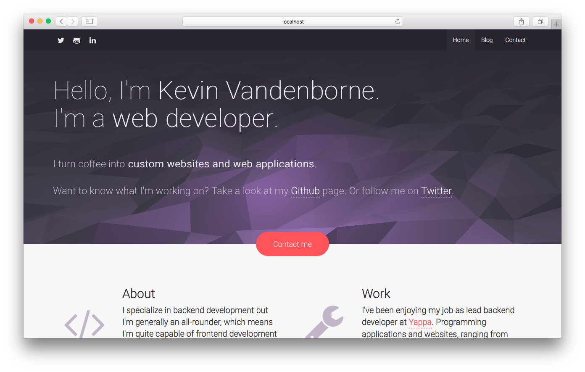

# Sourcebox

This is the source code for my personal website, you can look around but you can not copy. This is only for educational use.

## Requirements

- Node Package Manager (NPM)
- Gulp (`sudo npm install gulp --global`)

## Installation

Run `npm install` to install required node modules.

Use Gulp to build and watch changes:

- `gulp` to start the build process, watch changes and serve the site on `http://localhost:8000`
- `gulp watch` to watch changes in js, html and css files
- `gulp serve` to serve the site on `http://localhost:8000`
- `gulp js` to concat all the js files
- `gulp build` to manually start the build process
- `gulp less` to compile less into css.
- `gulp fonts` to move fonts to build directory
- `gulp cleanup` to remove build directory
